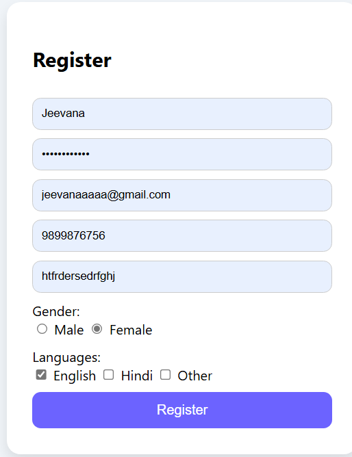

 Program 3: Client-Side Validation Using JavaScript

1. Aim
To implement client-side validation using JavaScript for a registration form and a shopping cart page.

2. Requirements
•Software: Google Chrome, VS Code / Any Text Editor
•Technologies: HTML, CSS, JavaScript

3. Theory
SDC observation
Client-side validation ensures that form inputs meet the required format before being sent to the server. JavaScript functions are used to check user input dynamically, preventing invalid data from being submitted and improving the user experience.

4. Features

4.1 Registration Form Validation
•Validates user input fields (name, email, and password).
•Ensures all fields are filled.
•Uses a regular expression to validate email format.
•Checks that the password is at least 6 characters long.
•Displays an alert for invalid input.

4.2 Shopping Cart Validation
•Retrieves cart items from localStorage.
•Validates quantity (must be a positive number).
•Displays an alert for incorrect input.
•Dynamically updates the total price.

5. Usage
1.Open the registration form and enter details.
2.Click the submit button to trigger validation.
3.Navigate to the shopping cart and check the quantities.
4.Adjust item quantities, ensuring all inputs are valid.
5.The total price updates dynamically.

6. Implementation
The validation logic is implemented using JavaScript. The registration form ensures valid inputs before submission, while the shopping cart checks item quantities and updates the total price accordingly.

7. License
This project is open-source and free to use.

Screenshots
