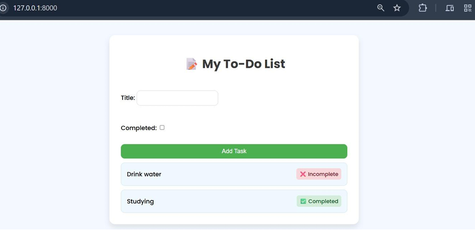

Program 16 – Django TODO App

AIM  
To develop a TODO list application backend using Django, allowing users to add, view, and manage tasks with a clean and functional web interface.

DESCRIPTION  
This experiment demonstrates how to build a server-rendered TODO application using Django. The app allows users to manage tasks—such as adding new tasks and viewing task lists—using Django's powerful Model-View-Template (MVT) architecture. It showcases key Django concepts like models, views, templates, forms, and URL routing. This project is ideal for beginners to learn about Django's ORM, template rendering, and basic backend development.

PROJECT STRUCTURE  

django_todo_app/
│
├── todo_project/ # Project settings folder
│ ├── init.py
│ ├── settings.py # Project configuration
│ ├── urls.py # Root URL configuration
│ └── wsgi.py # WSGI entry point
│
├── todo/ # Main app folder
│ ├── migrations/
│ ├── templates/
│ │ └── todo/
│ │ └── index.html # HTML template for the app
│ ├── init.py
│ ├── admin.py # Admin interface
│ ├── apps.py
│ ├── models.py # Task model
│ ├── views.py # Logic for handling requests
│ └── urls.py # URL routing for app
│
├── db.sqlite3 # SQLite database
├── manage.py # Django management script
└── README.md # Project documentation

 
 
INSTALLATION & SETUP PREREQUISITES  
•	Python 3.8+  
•	pip (Python package installer)  
•	VS Code or any code editor  
•	Basic knowledge of Django  

STEPS TO RUN THE PROJECT  
1.Create Project and App
django-admin startproject todo_project  
cd todo_project  
python manage.py startapp todo  

2.Define Model in todo/models.py
from django.db import models

class Task(models.Model):
    title = models.CharField(max_length=200)
    completed = models.BooleanField(default=False)

    def __str__(self):
        return self.title

3.Create and Apply Migrations
python manage.py makemigrations  
python manage.py migrate

4.Set Up Views, Templates, and URLs
In views.py, write logic to render tasks.
Create templates/todo/index.html.

Map URLs in todo/urls.py and include in todo_project/urls.py.

5.Run the Project
python manage.py runserver

6.Visit in Browser
Open your browser and go to:
http://127.0.0.1:8000/

LICENSE
This project is licensed under the MIT License.

Contributing
Feel free to fork this repository and suggest improvements via pull requests. All contributions are welcome!

Screensshot
